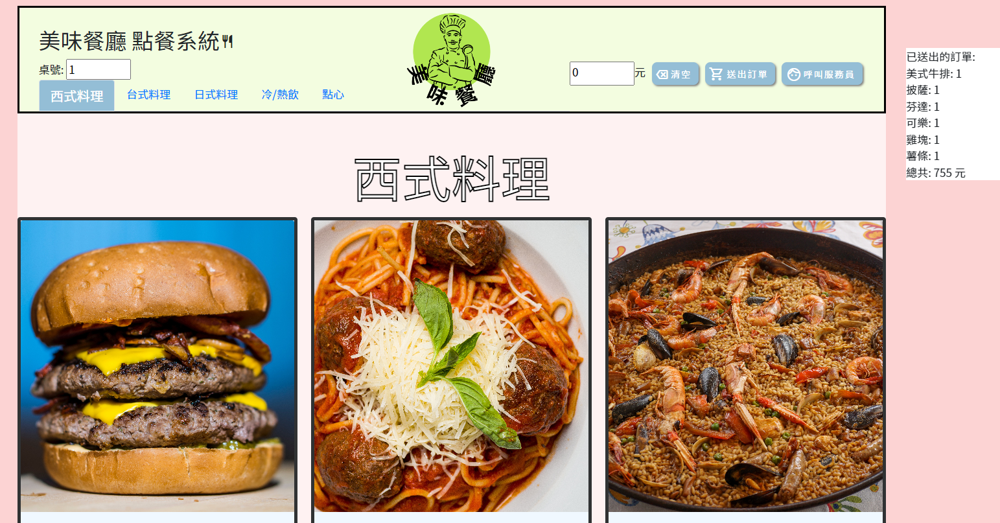
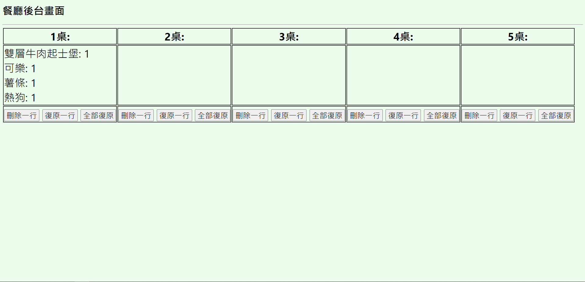
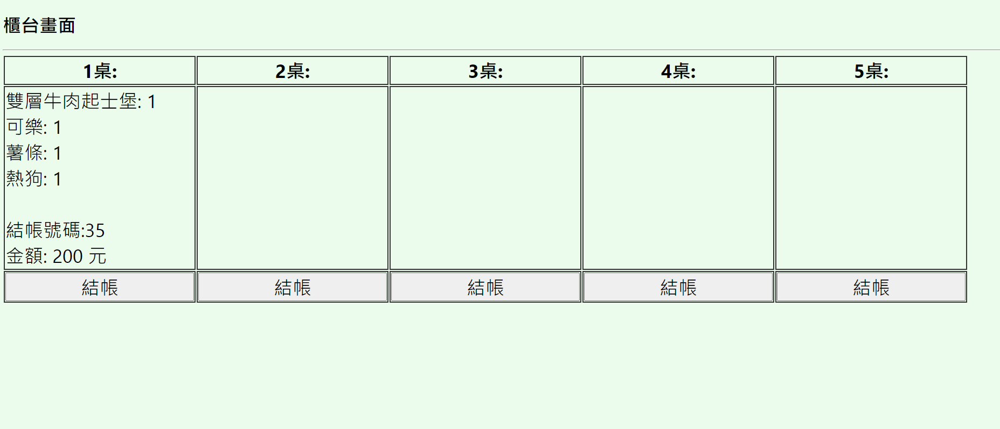

小專發表 餐廳點餐系統

## `專案介紹`

幫助客人點餐與幫助店家出餐

#### `功能介紹`
⌞點餐介面:消費者可以將點餐資料送出 
⌞廚房介面：廚房可以接收消費者傳來的點餐資料 
⌞櫃台結帳介面：店家可以計算總金額，並移除舊資料 

#### `頁面架構`

#### `使用技術`

## 專案展示
#### `點餐頁面`

#### `廚房頁面`

#### `櫃台頁面`

## 專案執行

1.須先建立MySQL資料庫:匯入restaurant.sql  
2.將work資料夾放入C:\xampp\htdocs  
點餐頁面:index.html  
廚房頁面:back.html  
櫃台頁面:counter.html

## Resource - 素材來源

[unsplash](https://unsplash.com/)

## Declaration - 聲明

本作品內圖片、內容等，純粹為個人練習前端使用，不做任何商業用途。