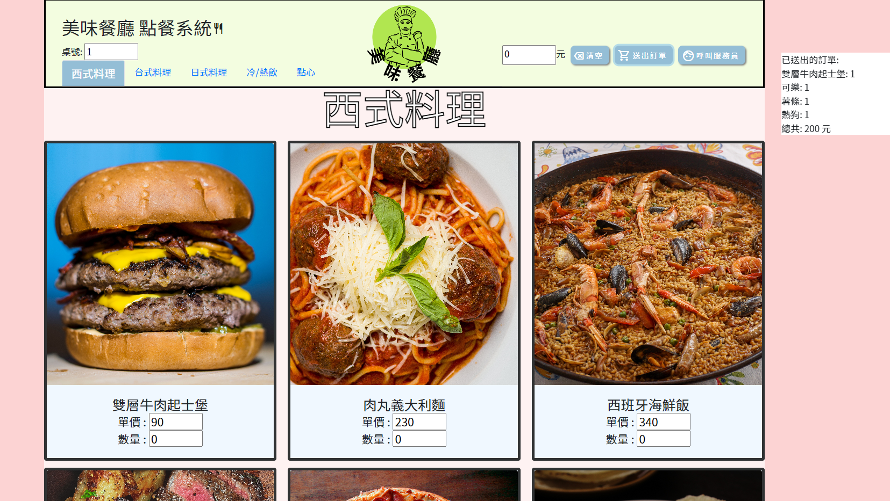
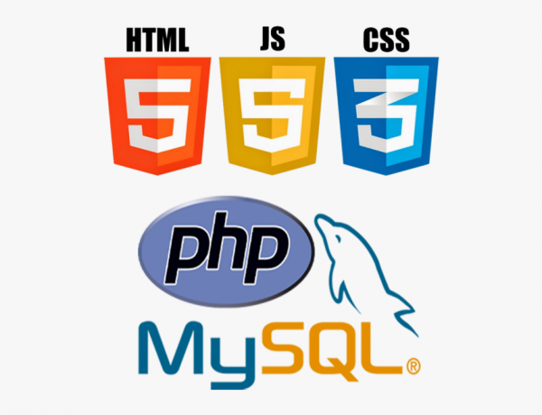

須先建立MySQL資料庫:匯入restaurant.sql  
將work資料夾放入C:\xampp\htdocs  
點餐頁面:index.html  
廚房頁面:back.html  
櫃台頁面:counter.html

## `專案介紹`

幫助客人點餐與幫助店家出餐

#### `功能介紹`
⌞點餐介面:消費者可以將點餐資料送出 
⌞廚房介面：廚房可以接收消費者傳來的點餐資料 
⌞櫃台結帳介面：店家可以計算總金額，並移除舊資料 

#### `頁面架構`

#### `使用技術`

## 專案展示
### 消費者相關功能

#### `菓季-主頁`

主視覺介紹： 
採用可愛童趣的繪本風格，那會採取這個風格除了符合我們的客群外， 也因為我們是客製繪畫蛋糕店，扣緊這個特色而去使用手繪繪本風格。 
色系採用較高明度的糖果色系。環境以自然景為主，帶出我們取材於天然美味的食材。 中間帶點甜食裝飾，使畫面更有童話感。以兔子角色為代表，給予品牌一個溫馨可愛的形象。 
提供資訊： 
- 首頁：主打活動輪播區、顯示人氣產品。
- 最新消息：瀏覽最新消息列表。
- 關於我們：瀏覽網站架設理念。
- 聯絡我們：瀏覽店家相關聯絡資訊、Google Maps 實體地址。 

功能： 
- 使用wow.js滾動監控播放動畫。 
- 製作圖層視差滾動。 
- 點擊按鈕，即可開啟系統內建郵件寄送郵件。 
- 按鈕互動效果(QR cord彈跳視窗、回頂部) 
 

#### `菓季-主題蛋糕頁`

說明： 
babababababababababababababababababababababababababababababababababababababababa 
提供資訊： 
- 輪播廣告：因為菓季的特色是每季會推出與小農合作的當季限定，因此購物相關頁面都會有。
- 目錄：提供消費者選單。
- 蛋糕展示：提供消費者蛋糕的展示。
- 頁尾：聯絡我們。
- 聯絡我們：放入line、mail、回最上面的功能。 

功能： 
- 功能01：你引用的技術點。
- 功能02：你引用的技術點。
- 功能03：你引用的技術點。
 

#### `菓季-蛋糕詳細頁`

說明： 
babababababababababababababababababababababababababababababababababababababababa 
功能： 
- 功能01：寫有哪些區塊，為消費者提供什麼。
- 功能02：寫有哪些區塊，為消費者提供什麼。
- 功能03：寫有哪些區塊，為消費者提供什麼。 

提供資訊： 
- 會員註冊：輸入並符合欄位格式，即可註冊成功。
- 會員登入：輸入帳號、密碼，即可登入。
- 會員身分驗證：登入後依會員權限顯示一般權限選單／管理權限選單。
- 會員專區：會員登入後可瀏覽或編輯個人資料、檢視消費紀錄。

#### `菓季-客製蛋糕頁`
說明： 
babababababababababababababababababababababababababababababababababababababababa 
功能： 
- 功能01：寫有哪些區塊，為消費者提供什麼。
- 功能02：寫有哪些區塊，為消費者提供什麼。
- 功能03：寫有哪些區塊，為消費者提供什麼。
 

#### `菓季-餡料食材介紹`

#### 管理者相關功能

#### `頁面架構`

#### `分類管理模組`

- 依照分類管理：可新增或編輯產品分類。

#### `產品管理模組`

- 依照規格管理：可新增或編輯產品資訊、產品規格。

#### `權限管理模組`

- 會員搜尋功能：可瀏覽所有帳號，依照使用者 id 或名稱搜尋特定帳號。
- 會員管理功能：可變更會員權限狀態，分為一般權限、管理權限、停權。

#### `訂單管理模組`

- 瀏覽所有訂單：可查看所有訂單明細，並依照訂單狀態顯示訂單進度。
- 訂單管理功能：可依照付款進度、出貨進度調整訂單狀態，或取消處理中訂單。

## 專案執行

1. 執行 `npm install` 安裝專案所需套件。

2. 執行 `npm run start`，在 http://localhost:3000 啟動專案。

3. 執行 `npm run dev`，使用 concurrently 實現同時在 http://localhost:3000 啟動前端，並在 http://localhost:5000 啟動後端專案。

4. 執行 `npm build`，在 build 資料夾建立專案 production 版本。

5. 執行 `npm deploy`，在 GitHub Pages 部屬專案網站。

## 專案前端技術

#### `框架`

- [React Hooks](https://reactjs.org/)
- [React DOM](https://www.npmjs.com/package/react-dom)

#### `第三方套件`

- [React Router DOM](https://reactrouter.com/)：使用內建 HashRouter 建立路由
- [styled-components](https://styled-components.com/)：使用 JSX 語法撰寫 CSS 樣式
- [PropTypes](https://www.npmjs.com/package/prop-types)：型別檢查
- [ESLint](https://eslint.org/)：檢查語法，統一程式撰寫風格
- [Prettier](https://prettier.io/)：統一程式碼格式
- [Google Map React](https://github.com/google-map-react/google-map-react)：串接 Google Cloud Platform
- [gh-pages](https://create-react-app.dev/docs/deployment/)：官方推薦的快速部署方法
- [bootstrap](https://getbootstrap.com/)：套用部分樣式
- [react-slick](https://react-slick.neostack.com/)：圖片輪播功能
- [react-spinners](https://www.npmjs.com/package/react-spinners)：讀取資料時套用特效
- [http-proxy-middleware](https://www.npmjs.com/package/http-proxy-middleware)：避免每次串接 API 必須帶入一串網址

#### `第三方 API`

- [Google Cloud Platform](https://cloud.google.com/)

## 專案後端技術

「Sweet Breath 甜の呼吸 - 網路甜點工作室」後端原始碼，採用 Express、Sequelize 開發，生成 API 與前端串連。

- 專案連結：[sweetbreath-backend](https://github.com/ivymuchacha/sweetbreath-backend)

## Resource - 資料引用來源

[unsplash](https://unsplash.com/)

## Declaration - 聲明

本作品內圖片、內容等，純粹為個人練習前端使用，不做任何商業用途。